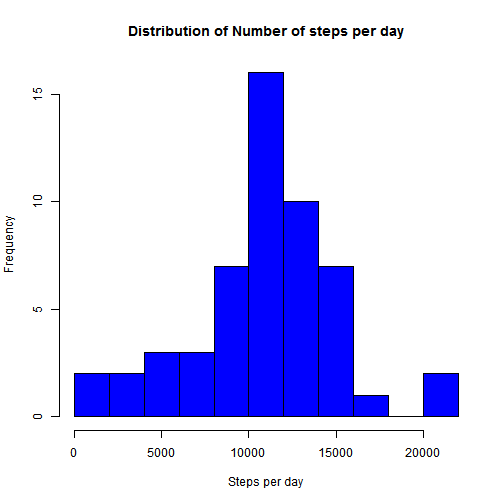
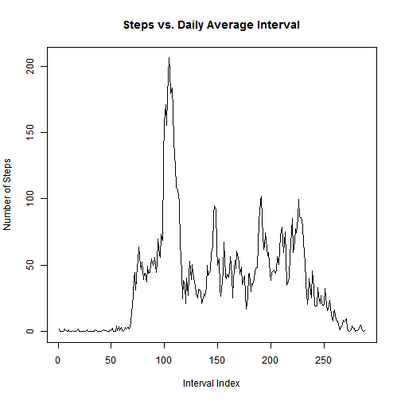
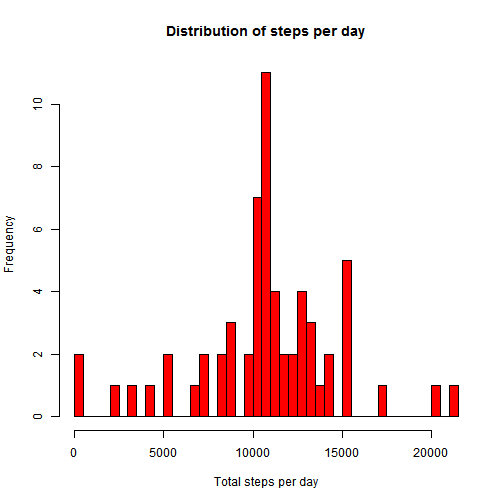
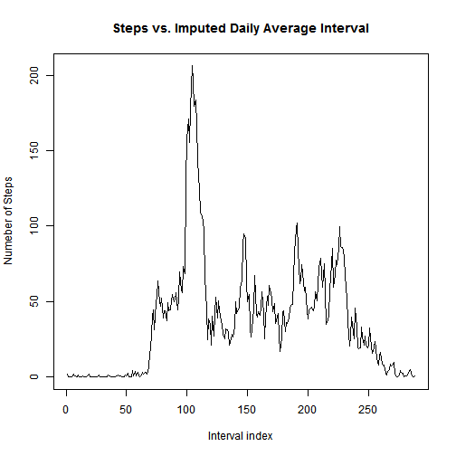
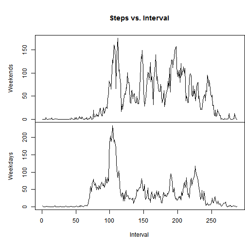

#Reproducible Research: PA 1

##Load data:


```r
df<-read.csv("activity.csv")
print("num of NA values"); colSums(is.na(df))
```

```
## [1] "num of NA values"
```

```
##    steps     date interval 
##     2304        0        0
```

##Total number of steps per day (ignoring NA values):
  * Calculate the total number of steps taken per day
  * Plot histogram of total steps per day

```r
sumsteps<-with(df,tapply(steps, date, FUN=sum))
print("sum of steps taken per day");print(sumsteps)
```

```
## [1] "sum of steps taken per day"
```

```
## 2012-10-01 2012-10-02 2012-10-03 2012-10-04 2012-10-05 2012-10-06 
##         NA        126      11352      12116      13294      15420 
## 2012-10-07 2012-10-08 2012-10-09 2012-10-10 2012-10-11 2012-10-12 
##      11015         NA      12811       9900      10304      17382 
## 2012-10-13 2012-10-14 2012-10-15 2012-10-16 2012-10-17 2012-10-18 
##      12426      15098      10139      15084      13452      10056 
## 2012-10-19 2012-10-20 2012-10-21 2012-10-22 2012-10-23 2012-10-24 
##      11829      10395       8821      13460       8918       8355 
## 2012-10-25 2012-10-26 2012-10-27 2012-10-28 2012-10-29 2012-10-30 
##       2492       6778      10119      11458       5018       9819 
## 2012-10-31 2012-11-01 2012-11-02 2012-11-03 2012-11-04 2012-11-05 
##      15414         NA      10600      10571         NA      10439 
## 2012-11-06 2012-11-07 2012-11-08 2012-11-09 2012-11-10 2012-11-11 
##       8334      12883       3219         NA         NA      12608 
## 2012-11-12 2012-11-13 2012-11-14 2012-11-15 2012-11-16 2012-11-17 
##      10765       7336         NA         41       5441      14339 
## 2012-11-18 2012-11-19 2012-11-20 2012-11-21 2012-11-22 2012-11-23 
##      15110       8841       4472      12787      20427      21194 
## 2012-11-24 2012-11-25 2012-11-26 2012-11-27 2012-11-28 2012-11-29 
##      14478      11834      11162      13646      10183       7047 
## 2012-11-30 
##         NA
```

```r
hist(sumsteps, breaks = length(sumsteps)/4, main = "Distribution of Number of steps per day", 
    xlab = "Steps per day", ylab = "Frequency", col = "blue")
```



  * Calculate and report the mean and median of the total number of steps taken per day

```r
mean<-mean(sumsteps,na.rm=TRUE)
median<-median(sumsteps,na.rm=TRUE)
print("Mean number of steps per day");print(mean)
```

```
## [1] "Mean number of steps per day"
```

```
## [1] 10766.19
```

```r
print("Median number of steps per day");print(median)
```

```
## [1] "Median number of steps per day"
```

```
## [1] 10765
```
##What is the average daily activity pattern?
  * Time series plot of the 5-min interval and the average number of steps taken, averaged across all days (y-axis)
  * Which 5-minute interval, on average across all the days in the dataset, contains the maximum number of steps?

```r
stepintervalmean<-with(df,tapply(steps,interval,FUN=mean,na.rm=TRUE))

plot(stepintervalmean,type='l',main = "Steps vs. Daily Average Interval",xlab = "Interval Index"
     ,ylab = "Number of Steps")
```



```r
interv<-seq(along = stepintervalmean)[stepintervalmean == max(stepintervalmean)]
print("The Interval with the maximum number of steps is");print(interv)
```

```
## [1] "The Interval with the maximum number of steps is"
```

```
## [1] 104
```
##Imputing missing values
  * Calculate and report the total number of missing values in the dataset.
  * Fill in all of the missing values in the dataset.
  * Create a new dataset that is equal to the original dataset but with the missing data filled in.
  * Make a histogram of the total number of steps taken each day and Calculate and report the mean      and median total number of steps taken per day. 
  * Do these values differ from the estimates from the first part of the assignment? What is the        impact of imputing missing data on the estimates of the total daily number of steps?

Strategy for imputing values:
Takes the stepinterval mean calculated previously and replaces the na's with it's appropriate interval mean.

```r
nas<-sum(is.na(df$steps))
print("Number of missing values") ; print(nas) 
```

```
## [1] "Number of missing values"
```

```
## [1] 2304
```

```r
# convert stepintervalmean to an array
simarray <- as.vector(stepintervalmean)
# Rep for each of the 61 days in order to achieve paralell index with df
simarray<- rep(simarray, 61)
# Set the non na values to 1
simarray[!is.na(df$steps)] <- 1

# Convert our df$steps into an array
steparray<-as.vector(df$steps)
# Set the missing values to 1
steparray[is.na(steparray)] <- 1

#multiply the arrays so that the imputed values will take the place of the na vals
# Add the imputed column to the original df
df$imputed <- simarray*steparray

impsteps <- with(df,tapply(imputed, date, FUN=sum))

hist(impsteps, breaks = length(impsteps/4), main = "Distribution of steps per day", 
    xlab = "Total steps per day", ylab = "Frequency", col = "red")
```



```r
impmean<-mean(impsteps)
print("The mean of total steps for the imputed data is"); print(impmean)
```

```
## [1] "The mean of total steps for the imputed data is"
```

```
## [1] 10766.19
```

```r
impmedian<-median(impsteps)
print("The median of total steps for the imputed data is"); print(impmedian)
```

```
## [1] "The median of total steps for the imputed data is"
```

```
## [1] 10766.19
```

```r
#plot interval mean
impmeanint<-with(df,tapply(imputed,interval,mean))

plot(impmeanint, type = "l", xlab = "Interval index", ylab = "Numeber of Steps", 
    main = "Steps vs. Imputed Daily Average Interval")
```



##Are there differences in activity patterns between weekdays and weekends?

  * Create a new factor variable in the dataset with two levels - "weekday" and "weekend"         

  * Make a panel plot containing a time series plot of the 5-minute interval and the average number of steps taken, averaged across all weekday days or weekend days.


```r
# Create a factor array where the variable is a factor of two levels weekdays, weekend-days
datefactor<-as.POSIXlt(df$date, format = "%Y-%m-%d")
days<- datefactor$wday
days[days == 0]<-0
days[days == 6]<-0
days[days != 0]<-1
factordays<-factor(days, levels = c(0, 1))
# Append factored array of days to the df
df$days<-factordays
# Calculate the mean
weekdaymean<-with(df,tapply(df$steps, list(interval,days), FUN=mean,na.rm=TRUE))

#create 2 side by side plots of the weekdays and weekends
par(mfrow = c(2, 1))
with(df, 
     {
    par(mai = c(0, 1, 1, 0))
    plot(weekdaymean[,1],type = "l",main=("Steps vs. Interval"),xaxt="n",ylab="Weekends")
    title = ("Number of Steps vs. Interval")
    par(mai = c(1, 1, 0, 0))
    plot(weekdaymean[, 2],type="l",xlab="Interval",ylab="Weekdays")

})
```


